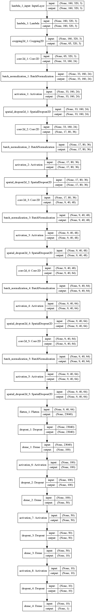
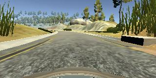
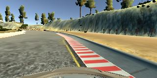
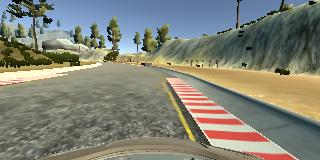
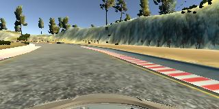
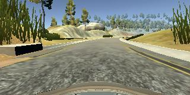

#**Behavioral Cloning** 

##Writeup

---

**Behavioral Cloning Project**

The goals / steps of this project are the following:
* Use the simulator to collect data of good driving behavior
* Build, a convolution neural network in Keras that predicts steering angles from images
* Train and validate the model with a training and validation set
* Test that the model successfully drives around track one without leaving the road
* Summarize the results with a written report


[image3]: ./examples/placeholder_small.png "Recovery Image"
[image4]: ./examples/placeholder_small.png "Recovery Image"
[image5]: ./examples/placeholder_small.png "Recovery Image"
[image6]: ./examples/placeholder_small.png "Normal Image"
[image7]: ./examples/placeholder_small.png "Flipped Image"

## Rubric Points
###Here I will consider the [rubric points](https://review.udacity.com/#!/rubrics/432/view) individually and describe how I addressed each point in my implementation.  

---
###Files Submitted & Code Quality

####1. Submission includes all required files and can be used to run the simulator in autonomous mode

My project includes the following files:
* model.py containing the script to create and train the model
* drive.py for driving the car in autonomous mode
* model.h5 containing a trained convolution neural network 
* writeup_report.md or writeup_report.pdf summarizing the results

####2. Submission includes functional code
Using the Udacity provided simulator and my drive.py file, the car can be driven autonomously around the track by executing 
```sh
python drive.py model.h5
```

####3. Submission code is usable and readable

The model.py file contains the code for training and saving the convolution neural network. The file shows the pipeline I used for training and validating the model, and it contains comments to explain how the code works.

###Model Architecture and Training Strategy

####1. An appropriate model architecture has been employed

The model structure architecture I used based on NVIDIA's paper [End-to-end Deep Learning for Self-driving Cars](https://arxiv.org/abs/1604.07316) . My model (model.py lines 98-142) has three blocks: preprocessing block, convolution blocks and fully-connected block, and my architecture has something different:

1. A lambda layer is used to normalize image and followed by a Cropping2D layer to crop images so the model inputs are the ROI of images actually;
2. In convolution block, data will go through a batch normalization block before it gets activated and I add spatial dropout layers after activations.
3. All the activations I used is ELU instead of ReLU to introduce nonlinearity;
4. Every fully-connected layers is followed by a dropout layers;
5. L2-Regularizer is used for every fully-connected layer and every convolutional layer to avoid overfitting;
6. Pooling layer is not used because I  think rotation invariance and slightly  translation invariance will have negative influence on this problem, since when the lane line is on the different position of the image, we may expect the different output.

####2. Attempts to reduce overfitting in the model

The model contains dropout layers in order to reduce overfitting: spatial dropout for convolutional layers and dropout for fully-connected layers.(model.py lines 107-139). 

The model was trained and validated on different data sets to ensure that the model was not overfitting (code line 46). The model was tested by running it through the simulator and ensuring that the vehicle could stay on the track.

####3. Model parameter tuning

The model used an adam optimizer, so the learning rate was not tuned manually (model.py line 89). I set the epochs to 100 and I save checkpoints when model of current epoch gets minimal validation loss.

####4. Appropriate training data

Before I collecting my own data, I trained my model on the data given by Udacity and iterated many times, finding out that the dataset is not enough to train the car (underfitting), so I drove the car by myself and collecting my own data.

Training data was chosen to keep the vehicle driving on the road. I used a combination of center lane driving, recovering from the left and right sides of the road, and drove the car both clockwise and counter-clockwise.

For details about how I created the training data, see the next section. 

###Model Architecture and Training Strategy

####1. Solution Design Approach

The overall strategy for deriving a model architecture was to totally the model from NVIDIA's paper, which was proven to work out the kind of problems. And the I add batch normalization layers for better performance.

In order to gauge how well the model was working, I split my image and steering angle data into a training and validation set. I found that my first model had a low mean squared error on the training set but a high mean squared error on the validation set. This implied that the model was overfitting. 

To combat the overfitting, I added  spatial dropout layers for convolutional layers and dropout layers for fully-connected layers, and also L2-Regularizers have used.

Then I retrained the model with more epoch, this time it works!

The final step was to run the simulator to see how well the car was driving around track one. Fortunately it runs well with only a few spots that it almost got out of the track, but it didn't.

At the end of the process, the vehicle is able to drive autonomously around the track without leaving the road.

####2. Final Model Architecture

For the details of the model , see this visualization of the architecture below:



####3. Creation of the Training Set & Training Process

To capture good driving behavior, I first recorded three laps on track one using center lane driving. Here is an example image of center lane driving:



I then recorded the vehicle recovering from the left side and right sides of the road back to center so that the vehicle would learn to how to drive back to center when it drive out of the track. These images show what a recovery looks like:





To augment the data sat, I also flipped images and angles thinking that this would give more data and make the model generalize better. For example, here is an image that has then been flipped:




After the collection process, I had 11,091 number of data points. I then add  the data I collected to the dataset given by Udacity, then I preprocessed the  data.


I finally randomly shuffled the data set and put 20% of the data into a validation set. 

I used this training data for training the model. The validation set helped determine if the model was over or under fitting. The ideal number of epochs was 20 as evidenced by the val_loss doesn't go lower when we train more. I used an adam optimizer so that manually training the learning rate wasn't necessary.